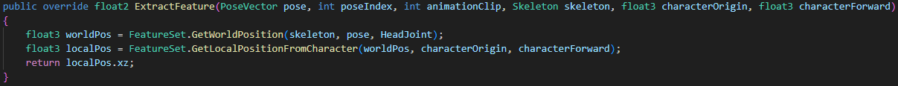

# Custom Trajectory Features

This package provides an advanced mechanism to extend the trajectory features used by Motion Matching, enabling you to incorporate custom data like the positions of other agents or objects.

## Overview

Within the `MotionMatchingData` scriptable object, you can select one of four custom trajectory feature types: `Custom 1D`, `Custom 2D`, `Custom 3D`, or `Custom 4D`.  These options define the dimensionality of the feature vector for *each point* in the trajectory.

!!! example
    The default position trajectory feature could be implemented as a `Custom 2D` feature. Although a trajectory consists of multiple points (the number of points is specified in the `Frames Prediction` setting), each point is represented by a 2D position on the ground plane (X and Z coordinates).  Other examples include using `Custom 1D` to represent agent density at future points or `Custom 2D` to represent the position of the closest agent at each point in the trajectory.

<figure markdown>
  
  <figcaption>Feature Selector in a `MotionMatchingData` scriptable object. Select a custom type to define your trajectory features.</figcaption>
</figure>

## Creating a Custom Feature

!!! example
    See the example script at `Examples/Scripts/Custom/Custom2DFeatureExtractor.cs`.

To create a new custom feature:

1. Create a new C# script that inherits from `Feature1DExtractor`, `Feature2DExtractor`, `Feature3DExtractor`, or `Feature4DExtractor`, depending on the desired dimensionality of your feature vector.

2. Override and implement the abstract functions.

    !!! important
        All features in Motion Matching *must* be relative to the character's local space. Ensure you convert features to character space before returning them from the `ExtractFeature()` function.

3. Add the `CreateAssetMenu` attribute *before* the class declaration. This allows you to create instances of your custom feature scriptable object in the Unity Editor. For example, `[CreateAssetMenu(fileName = "NewCustom2DFeatureExtractor", menuName = "Custom/Custom2DFeatureExtractor")]`.

    !!! tip
        Using scriptable objects for custom extractors is very useful for incorporating external data. For example, you might need to access external files to compute certain features. You can define public fields in your custom extractor class, which can then be assigned in the Unity Editor when you create an instance of the scriptable object.

4. Create an instance of your scriptable object via the editor (right-click in your project window -> Create -> [Your Custom Feature Type]) and assign it to the `MotionMatchingData` asset.

The following figure illustrates an example implementation:

<figure markdown>
  
  <figcaption>The `ExtractFeature()` function, called for each pose in the pose database. This example projects the head position onto the ground plane.</figcaption>
</figure>

This function is the core of feature extraction. It's called for every frame in your pose database.  In the example, the `GetWorldPosition()` helper function retrieves the world-space position of the head joint for the current pose.  Then, `GetLocalPositionFromCharacter()` converts this world-space position into the character's local space. Finally, the Y component (height) is removed to project the head position onto the ground plane, resulting in a 2D feature.