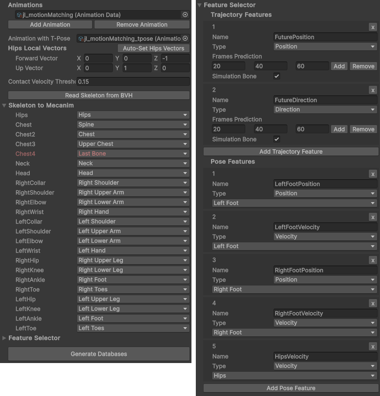

# Creating an Animation Database (*MMData*)

## Introduction

Animation databases hold the animation sets that the Motion Matching system utilizes to animate characters. These are specified via a scriptable object known as ```MotionMatchingData``` (*MMData*). To view an example, navigate to ``Animations/MMData/JLData.asset``.



## Steps to Create an MMData asset

### Add Animation Files

- Import one or more *.bvh* files into your project. Change their extensions to *.txt* so Unity will recognize them as *Text Assets*.

### Create AnimationData

- Right-click in the Project window and choose ``Create/MotionMatching/AnimationData``. Link this with the *Text Asset* from step 1. This *AnimationData* holds metadata like animation tags.

### Create MotionMatchingData (MMData)

- Right-click in the Project window and go to ``Create/MotionMatching/MotionMatchingData``.

	!!! tip
		You can duplicate the existing *MMData* at ``Animations/MMData/JLData.asset`` and use it as a starting point.

- Click *Add Animation* and link it to the *AnimationData* file. In the subsequent field labeled *Animation with T-Pose*, reference an *AnimationData* where the first frame shows the character in a T-Pose. Note that all *.bvh* files should have the same skeletal structure.

### Configure Skeleton

- Identify the world space coordinates of the hips/root joint local forward and up vectors of your *.bvh* skeleton. You can use the `Auto-Set Hips Vectors` button to automatically set these vectors based on the orientation of the character. First, click this button, then you will be redirected to a scene with the skeleton in your T-Pose *.bvh* file. You can then rotate the character so its forward and up vectors align with the world space axes. Once you are satisfied with the orientation, click the `Set Hips Local Vectors` button to save the orientation.

For example, in the following image, the character has been rotated to face the forward world axis. The final forward hips local vector is (0, 0, -1) and the up local vector is (0, 1, 0):

	
	
	!!! note
		You can click `Set Hips Local Vectors` to automatically save the local vectors. However, if you want to check it manually, ensure your *Gizmo handle position toggle* is set to local space. [More Info](https://docs.unity3d.com/Manual/PositioningGameObjects.html).

		The local forward and up vectors should correspond to the hips/root of the skeleton in the *.bvh* file, not your virtual character used for rendering in Unity.


- The *Contact Velocity Threshold* is used for determining foot contact points for the foot lock feature. You can leave this setting as is for now.

- Click *Read Skeleton from BVH* to open the *Skeleton to Mecanim* dropdown. This maps the *.bvh* skeletal structure to Unity's animation system. Some bones may auto-map based on their names; however, ensure all mappings are accurate. If a bone doesn't correspond to any in Unity, set it as *Last Bone* to ignore it.

	

### Feature Selection

- Expand the *Feature Selector* section to choose trajectory and pose features. This package offers fully customizable features, but modifying trajectory features might require code changes. For initial testing, you can copy the settings from ``Animations/MMData/JLData.asset``.

### Generate Database

- Click *Generate Databases*. This action will create the processed pose and feature databases under the ``StreamingAssets/MMDatabases`` directory.

Congratulations! You've successfully created an *MMData* file for your Motion Matching system. Feel free to experiment with these settings to best suit your project's requirements.