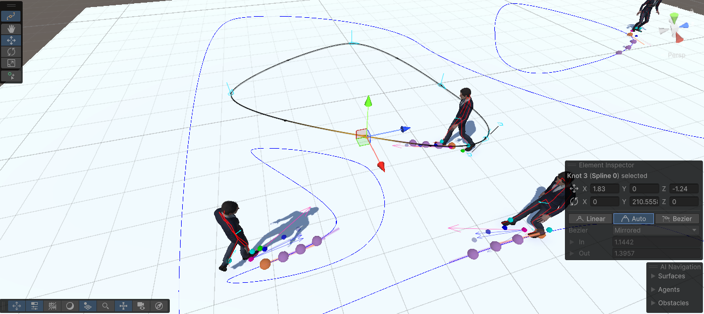

# Using Splines to drive Motion Matching

It is also possible to drive Motion Matching using splines. This method allows you to create more complex and dynamic paths for your characters to follow. The `SplineCharacterController` script is provided to help you achieve this.

!!! example
    To explore an example scene, access the Package Manager, select the **Motion Matching** package, and import the **Examples** sample. The sample scene will be located at `Samples/Motion Matching/[version]/Examples/Scenes/00_Basic/ExampleSplines.unity`.
	
**Getting Started:**

1. Add the `SplineCharacterController` script to a GameObject.
2. Create a spline using the `Spline` component. Visit the [Spline documentation](https://docs.unity3d.com/Packages/com.unity.splines@2.7) for more information.
!!! tip inline end
	Splines can be modified at runtime to create dynamic paths for your characters to follow.
3. Assign the spline to the `SplineCharacterController` script.
4. Assign a `MotionMatchingController` to the `SplineCharacterController` script.
5. Control the character's velocity by setting the `Speed` property of the `SplineCharacterController` script.

!!! note
	Feel free to modify the `SplineCharacterController` script to suit your needs. For example, you can add a method to set the character's speed based on the distance to the next waypoint.
	
	
