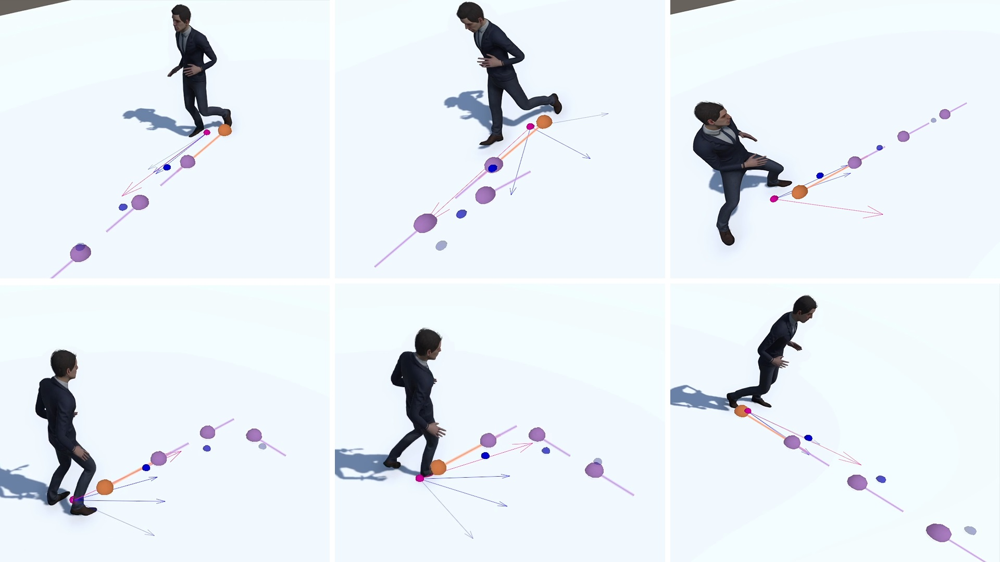
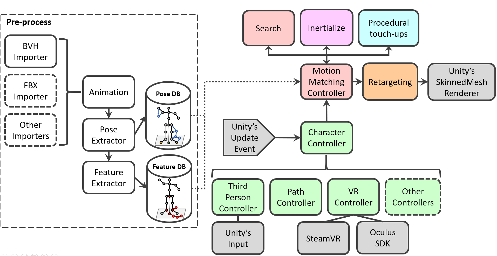

# Motion Matching for Unity



Welcome to the **Motion Matching** implementation designed for the **Unity** game engine. This project originated from the author's master thesis, providing a deep dive into both the Motion Matching technique and the workings of this specific Unity package. Download the complete thesis [here](https://www.researchgate.net/publication/363377742_Motion_Matching_for_Character_Animation_and_Virtual_Reality_Avatars_in_Unity) for an extensive overview. The project is a work-in-progress, aiming to offer a comprehensive Motion Matching solution for Unity. It can serve as a useful resource for those keen to learn or implement their own Motion Matching solution or even extend this existing package.

<figure markdown>
  
  <figcaption>Project Architecture. The two core components are the Motion Matching Controller (in red) and the Character Controllers (in green). Components with dashed outlines are not yet implemented.</figcaption>
</figure>

## Citation

If you find this package beneficial, please cite the SIGGRAPH Asia 2025 paper — it's the recommended citation. The master's thesis is kept below for background and extra details.

Preferred citation (recommended):

```bibtex
@article{2025:ponton:emm,
  author = {Ponton, Jose Luis and Andrews, Sheldon and Andujar, Carlos and Pelechano, Nuria},
  title = {Environment-aware Motion Matching},
  year = {2025},
  publisher = {Association for Computing Machinery},
  booktitle = {SIGGRAPH Asia 2025},
  address = {New York, NY, USA},
  issn = {0730-0301},
  doi = {10.1145/3763334},
  journal = {ACM Trans. Graph.},
}
```

Also for background:

```bibtex
@mastersthesis{ponton2022mm,
  author  = {Ponton, Jose Luis},
  title   = {Motion Matching for Character Animation and Virtual Reality Avatars in Unity},
  school  = {Universitat Politecnica de Catalunya},
  year    = {2022},
  doi     = {10.13140/RG.2.2.31741.23528/1}
}
```

## License

This project is distributed under the MIT License. For complete license details, refer to the [LICENSE](https://github.com/JLPM22/MotionMatching/blob/main/LICENSE) file.